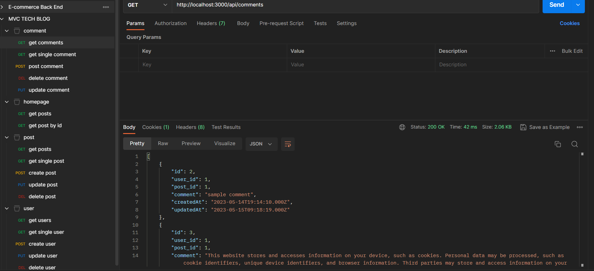
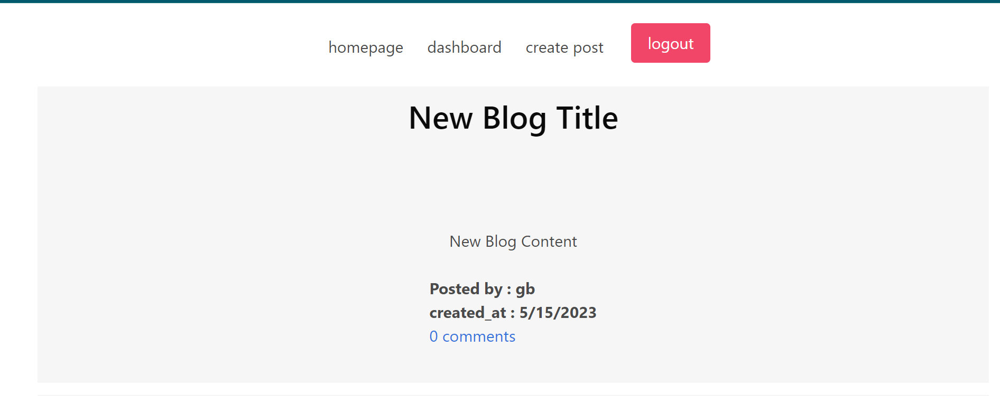
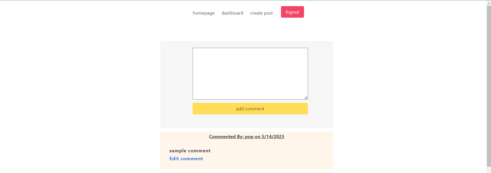
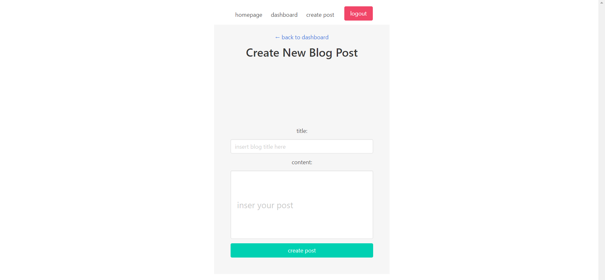
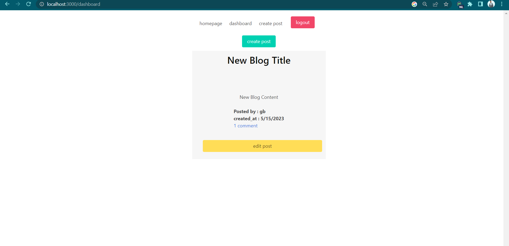
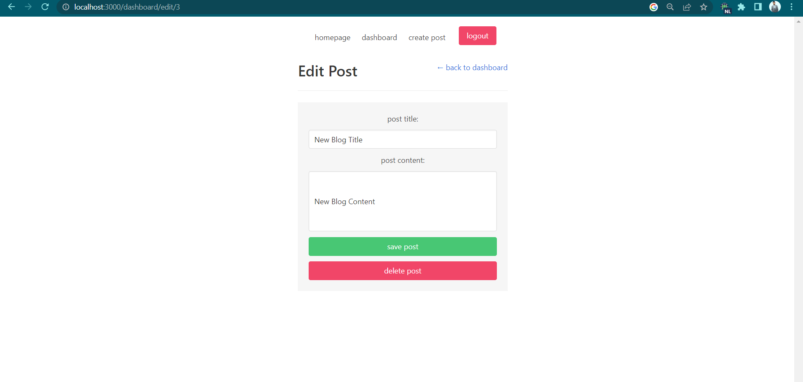
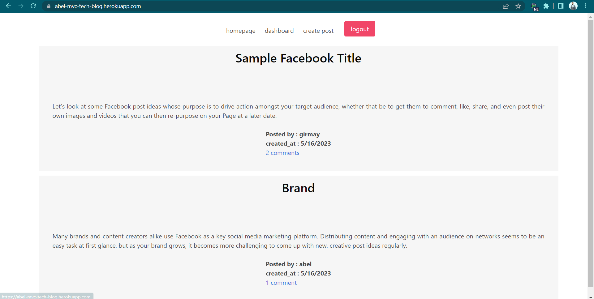

# E-commerce Back End 
A mysql database and CMS-style Blog built using Model View Controller (MVC) paradigm.
Built using MySQL2, Express, Sequelize, Handlebars and dotenv

## description
                GIVEN a CMS-style blog site
                WHEN I visit the site for the first time
                THEN I am presented with the homepage, which includes existing blog posts if any have been posted; navigation links for the homepage and the dashboard; and the option to log in
                WHEN I click on the homepage option
                THEN I am taken to the homepage
                WHEN I click on any other links in the navigation
                THEN I am prompted to either sign up or sign in
                WHEN I choose to sign up
                THEN I am prompted to create a username and password
                WHEN I click on the sign-up button
                THEN my user credentials are saved and I am logged into the site
                WHEN I revisit the site at a later time and choose to sign in
                THEN I am prompted to enter my username and password
                WHEN I am signed in to the site
                THEN I see navigation links for the homepage, the dashboard, and the option to log out
                WHEN I click on the homepage option in the navigation
                THEN I am taken to the homepage and presented with existing blog posts that include the post title and the date created
                WHEN I click on an existing blog post
                THEN I am presented with the post title, contents, post creator’s username, and date created for that post and have the option to leave a comment
                WHEN I enter a comment and click on the submit button while signed in
                THEN the comment is saved and the post is updated to display the comment, the comment creator’s username, and the date created
                WHEN I click on the dashboard option in the navigation
                THEN I am taken to the dashboard and presented with any blog posts I have already created and the option to add a new blog post
                WHEN I click on the button to add a new blog post
                THEN I am prompted to enter both a title and contents for my blog post
                WHEN I click on the button to create a new blog post
                THEN the title and contents of my post are saved and I am taken back to an updated dashboard with my new blog post
                WHEN I click on one of my existing posts in the dashboard
                THEN I am able to delete or update my post and taken back to an updated dashboard
                WHEN I click on the logout option in the navigation
                THEN I am signed out of the site
                WHEN I am idle on the page for more than a set time
                THEN I am automatically signed out of the site.
## Technologies
        Javascript
        Node.js
        Sequelize
        MySQL2
        Express
        Dotenv
## Installation
        step 1 :git clone https://github.com/AbelZemo/abel-mvc-tech-blog
        step 2 : Both Node.js and MySQL must be installed on your computer.
        step 3 : Install dependencies using the below commands
        ( 
                npm init --y
                npm install express sequelize mysql2
        )
        step 4 : Open up MySQL shell and type this input (source db/schema.sql)
        step 5 : type this input (use abel-mvc-tech-blog)
        step 6 : Then quit MySQL shell and input the following command in your terminal (npm run seed)
        step 7 : to start running application simply type this command 
        (
                npm start or node server.js
        )
        step 8 : Open up Insomnia or post man core to GET, POST, PUT and DELETE from different routes.

## screenshots

## Usage
step 1 : npm start
step 2 : open browser and browse http://localhost:3000/
step 3 : view homepage
step 4 : register and login
step 5 : create post and comment there
step 6 : edit your post and your comment 

## Deployed application link

https://abel-mvc-tech-blog.herokuapp.com/

